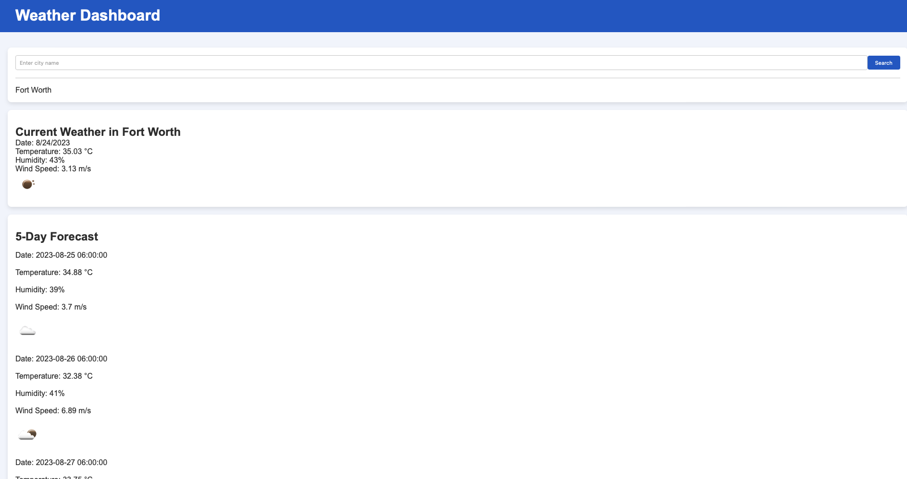

# Weather Dashboard



## Overview

Weather Dashboard is a web application that allows users to search for weather information for a specific city. It provides current weather conditions and a 5-day forecast, helping users plan their activities based on the weather forecast.

## Features

- Search for weather information for any city
- Display current weather conditions including temperature, humidity, wind speed, and weather icon
- Show a 5-day forecast with date, weather icon, temperature, wind speed, and humidity
- Maintain a search history for easy access to previously searched cities

## Installation

1. Clone this repository:

    ```bash
    https://github.com/IsaacOnGH/Weather-Dashboard.git
    ```
2. Open **index.html** in your preferred web browser.

## How to Use

1. Enter the name of the city in the search input field.
2. Click the "Search" button.
3. Current weather details and a 5-day forecast will be displayed.
4. Search history will be maintained for easy access to previously searched cities.

## Technologies and Dependencies

- HTML, CSS, JavaScript
- OpenWeatherMap API (API key required)
- Fetch API for making API requests

Made by [IsaacOnGH](https://github.com/IsaacOnGH)

